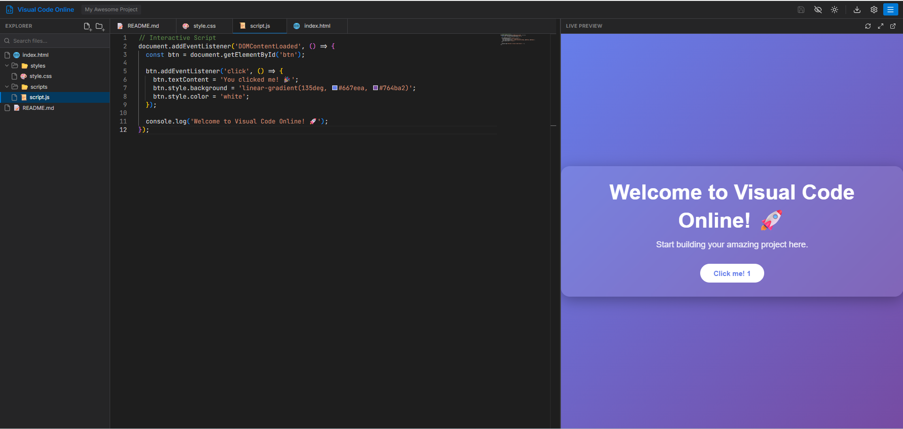
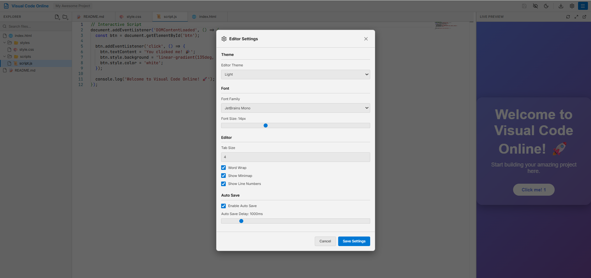
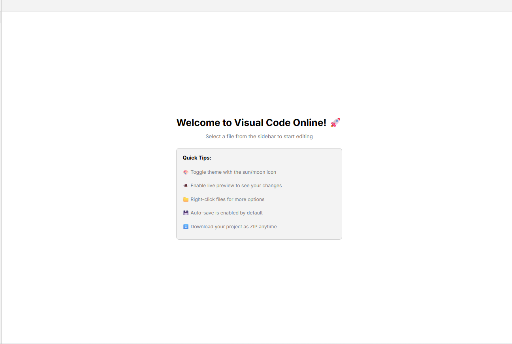

# 🚀 Visual Code Online

A powerful, feature-rich **online code editor** inspired by Visual Studio Code. Build your web projects entirely in the browser with live preview, multi-file support, and professional developer tools.


## ✨ Features

### 🎨 **Professional Code Editor**
- **Monaco Editor** - The same editor that powers VS Code
- **Syntax highlighting** for HTML, CSS, JavaScript, TypeScript, JSON, and Markdown
- **IntelliSense** - Smart code completion and suggestions
- **Multi-cursor editing** - Edit multiple locations simultaneously
- **Code formatting** - Auto-format on paste and type

### 📁 **File Management**
- **Hierarchical file tree** - Organize files and folders like VS Code
- **Create/Delete/Rename** - Full file system operations
- **Drag and drop** support (coming soon)
- **Search files** - Quickly find files in your project
- **Context menu** - Right-click for quick actions

### 📑 **Multi-Tab Support**
- **Open multiple files** simultaneously
- **Tab switching** with keyboard shortcuts (Ctrl+Tab)
- **Dirty state tracking** - See unsaved changes at a glance
- **Middle-click to close** tabs
- **Tab persistence** - Tabs survive page refresh

### 👁️ **Live Preview**
- **Real-time rendering** - See changes instantly
- **Automatic HTML/CSS/JS injection**
- **Refresh preview** manually when needed
- **Open in new tab** - Test in full browser window
- **Fullscreen mode** - Immersive preview experience

### 💾 **Auto-Save**
- **Automatic saving** with configurable delay
- **Manual save** with Ctrl+S
- **Save all** files at once
- **Dirty indicator** shows unsaved changes
- **LocalStorage persistence** - Never lose your work

### 🎭 **Theme Customization**
- **Dark theme** - Easy on the eyes (default)
- **Light theme** - For daytime coding
- **Synchronized themes** - Editor and UI match
- **Persistent preference** - Remember your choice

### ⚙️ **Editor Settings**
- **Font customization** - Choose from 6+ monospace fonts
- **Font size** - Adjustable from 10px to 24px
- **Tab size** - Configure indentation (2-8 spaces)
- **Word wrap** - Toggle line wrapping
- **Minimap** - Bird's eye view of your code
- **Line numbers** - Toggle visibility

### 📦 **Project Management**
- **Multiple projects** - Work on several projects
- **Download as ZIP** - Export entire project
- **Import projects** (coming soon)
- **Project templates** - Start with sample code

### ⌨️ **Keyboard Shortcuts**
- `Ctrl+S` - Save all files
- `Ctrl+W` - Close active tab
- `Ctrl+N` - New file
- `Esc` - Close modals
- `Right-click` - Context menu

## 📸 Application Interface Preview

<p align="center">
  Below are screenshots from the <code>src/image</code> folder, showcasing the core features of <b>Visual Code Online</b>.
</p>

---

### 🖥️ 1. Main Interface & Live Preview

<p align="center">
  
</p>

<p align="center">
  <i>
    This screenshot shows the primary workspace of <b>Visual Code Online</b>.
    The layout uses a split-screen design:
    the left panel is a code editor (currently editing <code>script.js</code> with syntax highlighting),
    while the right panel displays a real-time <b>Live Preview</b>.
    Any code changes are instantly reflected in the preview,
    demonstrating a styled UI with a gradient background and interactive button.
  </i>
</p>

---

### ⚙️ 2. Editor Settings Modal

<p align="center">
  
</p>

<p align="center">
  <i>
    The <b>Editor Settings</b> modal allows users to fully customize their coding experience.
    Available options include Editor Theme (Light mode shown),
    Font Family (JetBrains Mono), Font Size, and Tab Size.
    Additional toggles enable or disable Word Wrap, Minimap, Line Numbers,
    and Auto Save for improved productivity.
  </i>
</p>

---

### 🎉 3. Welcome Screen & Quick Tips

<p align="center">
  
</p>

<p align="center">
  <i>
    This image displays the Welcome (Empty State) screen when no file is selected.
    A clean and friendly interface greets the user with
    <b>“Welcome to Visual Code Online!”</b>.
    The <b>Quick Tips</b> section provides helpful shortcuts,
    including theme toggling, enabling live preview,
    right-click actions, and project download instructions.
  </i>
</p>


## 🛠️ Tech Stack

- **React 19** - Latest React with modern features
- **TypeScript 5.9** - Type-safe development
- **Monaco Editor** - Professional code editing
- **Vite** - Lightning-fast build tool
- **JSZip** - Project export functionality
- **Lucide React** - Beautiful icon library

## 🚀 Getting Started

### Installation

```bash
# Install dependencies
npm install

# Start development server
npm run dev

```

### Development

The app will be available at `http://localhost:5173`

## 📖 Usage Guide

### Creating Files and Folders

1. **New File**: Click the file+ icon in the sidebar or press `Ctrl+N`
2. **New Folder**: Click the folder+ icon
3. **Inside Folder**: Right-click a folder → New File/Folder

### Opening Files

- Click any file in the sidebar to open it in a new tab
- Files open in the Monaco Editor with syntax highlighting

### Editing Code

- Type normally - IntelliSense will suggest completions
- Use `Ctrl+Space` for manual completion
- Format code with `Shift+Alt+F`
- Multi-cursor: `Alt+Click`

### Live Preview

1. Toggle preview panel with the eye icon
2. Preview updates automatically as you code
3. Click refresh to force re-render
4. Open in new tab for full-browser testing

### Managing Projects

- **Download**: Click download icon to get ZIP
- **New Project**: Click menu icon → Create new
- **Switch Projects**: (Coming soon)

### Customizing Settings

1. Click the settings icon
2. Configure:
   - Theme (Dark/Light)
   - Font family and size
   - Editor preferences
   - Auto-save settings
3. Click "Save Settings"

### Context Menu Actions

Right-click any file/folder for:
- Rename
- Duplicate (files only)
- Download
- Delete
- New File (folders only)
- New Folder (folders only)

## 🎯 Features in Detail

### Auto-Save System

Files are automatically saved after you stop typing for a configurable delay (default: 1000ms). You can:
- Enable/disable auto-save in settings
- Adjust the delay (500ms - 5000ms)
- Manual save with `Ctrl+S`

### LocalStorage Persistence

Your entire workspace is saved to browser storage:
- All projects and files
- Open tabs and active file
- Editor settings
- Theme preference

**Note**: Clear browser data will erase projects. Export important work!

### Live Preview Technology

The preview uses an iframe with automatic code injection:
1. Finds your `index.html`
2. Inlines all CSS from `<link>` tags
3. Inlines all JS from `<script>` tags
4. Renders in sandboxed iframe

### File Type Detection

Automatic language detection based on extension:
- `.html` → HTML
- `.css` → CSS
- `.js`, `.jsx` → JavaScript
- `.ts`, `.tsx` → TypeScript
- `.json` → JSON
- `.md` → Markdown

## 🎨 Default Project

First-time users get a beautiful sample project featuring:
- Gradient background
- Interactive button
- Modern glassmorphism design
- Organized file structure
- Best practices demonstrated

## 🔒 Security

- **Sandboxed iframes** - Safe code execution
- **No server-side code** - Pure client-side app
- **LocalStorage only** - Data stays in your browser
- **No external requests** - Complete privacy

## 🌐 Browser Compatibility

- ✅ Chrome/Edge 90+
- ✅ Firefox 88+
- ✅ Safari 14+
- ✅ Opera 76+

## 📱 Responsive Design

- **Desktop-first** - Optimized for coding
- **Tablet support** - Works on iPad
- **Mobile** - Limited (not recommended for coding)

## 🚧 Roadmap

- [ ] Drag-and-drop file upload
- [ ] Import ZIP projects
- [ ] Git integration
- [ ] Collaborative editing
- [ ] React/Vue component preview
- [ ] NPM package installation
- [ ] Terminal integration
- [ ] Extensions system
- [ ] Project templates library
- [ ] Export to GitHub

## 💡 Tips & Tricks

### Performance
- Close unused tabs to save memory
- Disable minimap for small files
- Use word wrap for long lines

### Workflow
- Use keyboard shortcuts for speed
- Enable auto-save for peace of mind
- Download projects regularly as backup

### Customization
- Try different fonts to find your favorite
- Adjust font size for comfort
- Use dark theme to reduce eye strain

## 🐛 Troubleshooting

### Preview not updating?
- Click the refresh button
- Check if you have `index.html`
- Verify file paths in HTML

### Lost your work?
- Check if browser data was cleared
- Enable auto-save in settings
- Download projects as backup

### Editor feels slow?
- Close unused tabs
- Reduce file size
- Disable minimap

### Settings not saving?
- Check LocalStorage is enabled
- Ensure browser allows storage
- Try different browser

## 📄 License

MIT License - Feel free to use for personal or commercial projects!

## 🙏 Acknowledgments

- **Monaco Editor** - Microsoft's excellent web editor
- **VS Code** - Inspiration for UI and features
- **React Team** - Amazing framework
- **Vite** - Blazing fast build tool

## 📞 Support

Found a bug? Have a feature request?
- Open an issue on GitHub
- Star the repo if you like it!

---

**Built with ❤️ using React + TypeScript + Monaco Editor**

## 🔗 Author's GitHub

<div align="center">


<p align="center">
  <a href="https://github.com/Kietnehi">
    
  </a>
</p>

<h3>🚀 Truong Phu Kiet</h3>

<a href="https://github.com/Kietnehi">
  
</a>


<br/><br/>

<p align="center">
  
  
</p>

<h3>🛠 Tech Stack</h3>
<p align="center">
  <a href="https://skillicons.dev">
    
  </a>
</p>

<br/>

<h3>🌟 Copilot Visual Online</h3>
<p align="center">
  <a href="https://github.com/Kietnehi/FaceRecognition_WEB">
    
    
    
  </a>
</p>
<!-- Dynamic quote -->
<p align="center">
  
</p>
<p align="center">
  <i>Thank you for visiting! Don’t forget to click <b>⭐️ Star</b> to support the project.</i>
</p>


</div>

